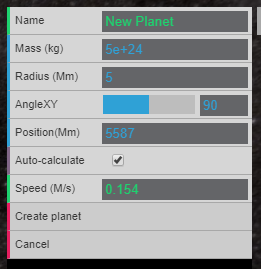
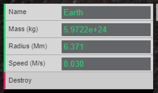
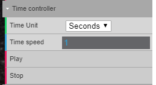
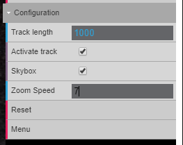

# Sunbox
Sunbox is a web simulation of the solar system made with the library three.js.  
You can use it [here](https://nachodlv.github.io/)  

## Collaborators
- [Eduardo Lalor](https://github.com/Dwape)

## Modes
**Sandbox**: starts with only one planet  
**Solar System**: starts with the planets of the solar system.

# Features

## Menu
  
List of the current planets in the simulation. Click on any planet of the list to move to it and see its specifications.  
Add planet creates a new planet.

## Add new planet
When add planet is clicked in the [Menu](#Menu) a red line will appear.

Click anywhere on the red line to choose the position of the planet to be created. A menu like the one below will appear.

- **Name**: name of the new planet
- **Mass(kg)**: mass in kilograms. More mass equals more gravity force.
- **Radius (Mm)**: radius in megameters (one million metres). The radius does not affect the gravity of the new planet.
- **AngleXY**: 
- **Position (Mm)**: distance from the sun in megameters.
- **Auto-calculate**: if it is ticked the speed will be automatically calculated so the planet can orbit the sun. It takes on account the mass and the distance from the sun. Other planets gravitational fields are not considered.
- **Speed (M/s)**: the speed the planet will have on its creation. The unit is in megameters per second.

## Edit planet
When clicked on a planet planet from the [Menu](#Menu) a menu like the one below will appear.  
  
The Name, Mass, Radius and Speed field are the same as [Add new Planet](#Add-new-planet)  
**Destroy**: destroys the planet selected.

## Time controller
  

- **Time Unit**: represents the time unit of a frame. If seconds is selected it means that every frame will represent a second in the simulation.
- **Time Speed**: the time unit multiplier.
- **Play**: resume the simulation if it is stopped.
- **Stop**: pause the simulation

## Configuration
 

- **Track length**: the length of the path that the planets draw when moving.
- **Activate track**: if it is ticked the tracks will be shown, if it is not the tracks will be hidden.
- **Skybox**: if it is ticked it will show the background image.
- **Zoom speed**: the scrolling speed.
- **Reset**: resets all changes made to the simulation.
- **Menu**: returns to the main menu.